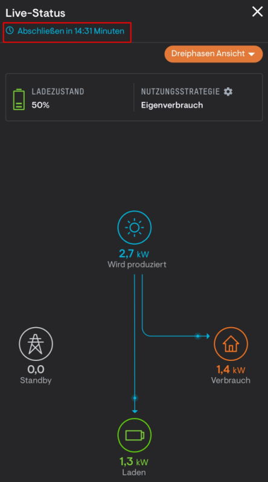

# Anbindung einer Enphase-IQ-Battery an EVCC

## Option 1) Nutzung EVCC Standard Template

Die EVCC.yaml sieht wie folgt aus:

```yml
meters:
- type: template
  template: enphase
  usage: grid
  host: <Enter Enphase IQ Gateway IP here>
  token: <Enter Enphase Token here>
  name: grid1
- type: template
  template: enphase
  usage: pv
  host: <Enter Enphase IQ Gateway IP here>
  token: <Enter Enphase Token here>
  name: pv2
- type: template
  template: enphase
  usage: battery
  host: <Enter Enphase IQ Gateway IP here>
  token: <Enter Enphase Token here>
  name: battery3

[...]

site:
  title: EVCC-Example-Site
  meters:
    grid: grid1
    pv:
    - pv1
    - pv2
    battery:
    - battery3
  residualPower: 100
```
Vorteile:
- einfache Konfiguration

Nachteile:
- offiziell nur für Enphase "AC Battery" ("AC" ist hierbei ein Produkttyp) und diese Konfiguration unterstützt nur teilweise die neueren Enphase Batterien des Typs "IQ Battery"
- Innerhalb von EVCC wird eine IQ Battery zwar mit dem aktuellen Ladestand (SoC) angezeigt, jedoch bleiben die Lade- bzw. Entladeströme in (W) bei 0.


## Option 2) Nutzung EVCC Custom-Template für die Enphase IQ Battery

Der in der Standard Konfiguration erzeugte Block für eine Enphase Batterie
```yml
- type: template
  template: enphase
  usage: battery
  host: <Enter Enphase IQ Gateway IP here>
  token: <Enter Enphase Token here>
  name: battery3
```

wird ersetzt durch

```yml
- name: battery3
  type: custom
  power:
    source: http
    uri: https://<Enter Enphase IQ Gateway IP here>/ivp/livedata/status
    method: GET
    auth:
      type: bearer
      password: <Enter Enphase Token here>
    insecure: true
    jq: .meters.storage.agg_p_mw
    scale: 0.001
  soc:
    source: http
    uri: https://<Enter Enphase IQ Gateway IP here>/ivp/livedata/status
    method: GET
    auth:
      type: bearer
      password: <Enter Enphase Token here>
    insecure: true
    jq: .meters.soc
  capacity: 3.5 # kWh
```

In der "Enlighten" App kann der Live Status immer nur für 15 Minuten aktiviert werden. Anschließend sieht EVCC mit dieser Konfiguration keine aktuellen Werte mehr.



Wie kann das verhindert werden?
Mittels Cron-Daemon wird zeitbasierten die Ausführung eines Befehls als wiederkehrende Aufgabe automatisiert, welche den Live Status alle 14 Minuten aktiviert.

```
sudo crontab -e
```

```
*/14 * * * * curl -f -k -H "Authorization:bearer <Enter Enphase Token here>" -H "Content-Type:application/json" -d "{\"enable\":1}" https://<Enter Enphase IQ Gateway IP here>/ivp/livedata/stream
```

Wer damit leben kann, dass die Daten nur am Tag aktualisiert werden (hier im Beispiel 7-20 Uhr) kann den Cronjob auch wie folgt anlegen:
```
*/14 7-20 * * * curl -f -k -H "Authorization:bearer <Enter Enphase Token here>" -H "Content-Type:application/json" -d "{\"enable\":1}" https://<Enter Enphase IQ Gateway IP here>/ivp/livedata/stream
```

Der curl Befehl kann zunächst auch einfach mittels SSH auf dem Linux System getestet werden. Die Rückgabe nach Ausführung sollte sein:
```
[...]
"sc_stream": "enabled"
```

That's it! EVCC sollte jetzt alle Werte (SoC und Lade- bzw. Entladeströme) korrekt anzeigen:


### Erweiterung crontab per Bash Script
Das folgende Skript kann per crontab ausgeführt werden und prüft, ob der LiveStatus aktiviert ist. Ferner wird geprüft, ob ein Auto am Ladepunkt angeschlossen ist.
Nur wenn beide Bedingungen erfüllt sind, wird der Enphase Live Status aktiviert. (Danke an JAK0721 für die Vorlage!)

livestatus.sh
```bash
#!/bin/bash
s1="disabled"
sleep 3
s2=$(curl -f -k -H "Accept: application/json" -H "Authorization: Bearer ey..." -X GET https://192.168.x.x/ivp/livedata/status | jq -r .connection.sc_stream)


# EVCC Status Loadpoint Connected True / False
s3=$(curl -f -k -H "Accept: application/json" -X GET http://evcc:7070/api/state | jq -r .result.loadpoints[].connected)
s4="true"

echo "EVCC Loadpoint Status Connected:"
echo $s3
echo "-----"
echo "Status Enphase Live-Status:"
echo $s2
echo "-----"

if [ $s1 == $s2 ] && [ $s4 == $s3 ]
then
  curl -f -k -H "Authorization:bearer ey..." -H "Content-Type:application/json" -d "{\"enable\":1}" https://192.168.x.x/ivp/livedata/stream
  echo "Enphase Live-Status activated."
else
  echo "Enphase Live-Status was already activated or no car connected to Loadpoint."
fi
```
